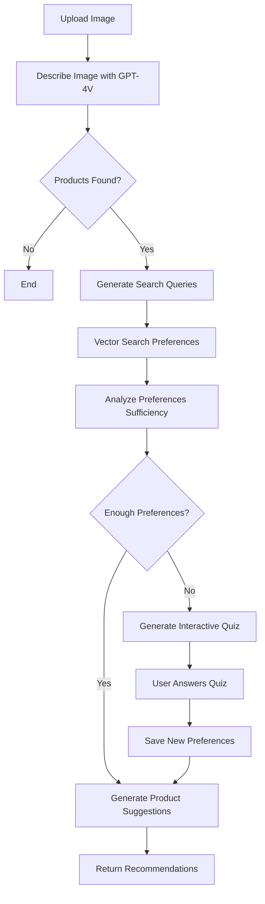

# 🛒 Agentic Shopping List Backend

An intelligent shopping list management system powered by AI that analyzes images, understands user preferences, and provides personalized product recommendations using LangGraph and OpenAI.

## 🌟 Overview

This project implements an agentic workflow that combines computer vision, natural language processing, and vector search to create intelligent shopping experiences. The system can analyze product images, extract user preferences, and provide personalized recommendations based on stored preference history.

## 🏗️ Architecture

The system is built on a **multi-agent graph-based architecture** using LangGraph, featuring three main workflows:

### 🎯 Core Workflows

1. **Product Recommendation Workflow** (`recommender/graph/`)
   - Analyzes product images using OpenAI Vision API
   - Searches for relevant user preferences using vector similarity
   - Generates personalized product suggestions
   - Conducts interactive quizzes when preferences are insufficient

2. **Data Extraction Workflow** (`extractor/`)
   - Extracts shopping items and preferences from natural language
   - Categorizes products automatically
   - Handles duplicate detection and data persistence

3. **Vector Search Workflow** (`retriever/`)
   - Orchestrates parallel vector searches across user preferences
   - Implements semantic search using OpenAI embeddings

## 🛠️ Technology Stack

- **Framework**: FastAPI
- **AI/ML**: LangGraph, LangChain, OpenAI GPT-4.1
- **Database**: TiDB with Vector Search capabilities
- **Embeddings**: OpenAI text-embedding-3-small
- **Template Engine**: Jinja2 for prompt templates

## 📊 Database Schema

### Tables

1. **`shopping_list_table`**
   - User shopping items with categories, quantities, and purchase status
   - Supports AI-generated recommendations

2. **`preference_table`**
   - User preferences with vector embeddings
   - Enables semantic search and personalization

3. **`category`**
   - Product categorization system

## 🚀 API Endpoints

### Product Recommendation
- `POST /api/recommend/get_product_recommendation`
  - Upload product image for AI analysis
  - Returns streaming responses with recommendations or interactive quizzes

- `POST /api/recommend/quiz_resume`
  - Submit quiz answers to continue recommendation process

### Shopping List Management
- `GET /api/shopping_list/get_shopping_list` - Retrieve user's shopping list
- `POST /api/shopping_list/mark_purchased` - Mark items as purchased
- `DELETE /api/shopping_list/delete` - Remove items from list

### Preference Management
- `GET /api/preference/get_preference_list` - Get user preferences (with optional semantic search)
- `POST /api/preference/update` - Update existing preferences
- `DELETE /api/preference/delete` - Remove preferences

### Data Extraction
- `POST /api/extractor/insert_data` - Extract and store shopping items and preferences from text

### Categories
- Category management endpoints for product classification

## 🔄 Workflow Details

### Product Recommendation Flow



### Key Features

- **Intelligent Image Analysis**: Uses GPT-4 Vision to identify and describe products in images
- **Semantic Preference Search**: Leverages vector embeddings to find relevant user preferences
- **Dynamic Quiz Generation**: Creates personalized questions when more user insights are needed
- **Smart Recommendations**: Combines visual analysis with preference history for targeted suggestions
- **Streaming Responses**: Real-time updates during processing workflows

## 🔧 Configuration

### Environment Variables

```bash
# TiDB Configuration
TIDB_HOST=your_tidb_host
TIDB_PORT=4000
TIDB_USERNAME=your_username
TIDB_PASSWORD=your_password
TIDB_DATABASE=your_database

# OpenAI Configuration
OPENAI_API_KEY=your_openai_api_key
```

### LLM Models

The system uses different GPT-4.1 models based on task complexity:
- **nano**: `gpt-4.1-nano-2025-04-14` (simple tasks)
- **mini**: `gpt-4.1-mini-2025-04-14` (moderate complexity)
- **large**: `gpt-4.1-2025-04-14` (complex reasoning - default)

## 🎨 Intelligent Features

### AI-Powered Product Suggestions
The system can intelligently recommend complementary products:
- **Meal Context**: Suggests missing ingredients for recipes
- **Health & Wellness**: Recommends supporting products for fitness goals
- **Household Tasks**: Suggests complementary cleaning or repair items
- **Personal Care**: Recommends related skincare or hygiene products

### Preference Learning
- Automatically extracts user preferences from natural language
- Detects and prevents duplicate preferences
- Builds comprehensive user profiles over time
- Supports semantic search across preference history

### Interactive Preference Collection
When insufficient preferences are detected:
1. Generates contextual questions about discovered products
2. Collects user responses through interactive quizzes
3. Automatically saves new insights to preference database
4. Continues with enhanced recommendation generation

## 📦 Installation

1. **Clone the repository**
   ```bash
   git clone <repository-url>
   cd agentic-shopping-list-backend
   ```

2. **Install dependencies**
   ```bash
   pip install -r requirements.txt
   ```

3. **Set up environment variables**
   ```bash
   cp .env.example .env
   # Edit .env with your configuration
   ```

4. **Run the application**
   ```bash
   python app.py
   ```

The server will start on `http://localhost:8000` with API documentation available at `/docs`.

## 🏃‍♂️ Development

### Project Structure
```
├── app.py                 # FastAPI application entry point
├── requirements.txt       # Python dependencies
├── 
├── db/                   # Database layer
│   ├── database_service.py
│   ├── vector_db_search.py
│   └── model/           # Database table schemas
│
├── server/              # API routes and models
│   ├── route/          # FastAPI route handlers
│   └── model/          # API request/response models
│
├── recommender/        # Product recommendation system
│   └── graph/          # Main recommendation workflow
│       ├── builder.py  # Graph construction
│       ├── nodes.py    # Workflow nodes
│       └── type.py     # Type definitions
│
├── extractor/          # Data extraction workflow
│   └── graph/
│
├── retriever/          # Vector search workflow
│   └── graph/
│
├── prompt/             # Jinja2 prompt templates
├── llm/               # LLM configuration
└── di/                # Dependency injection
```

### Running Tests
```bash
pytest tests/
```

## 🤝 Contributing

1. Fork the repository
2. Create a feature branch
3. Make your changes
4. Add tests for new functionality
5. Submit a pull request
